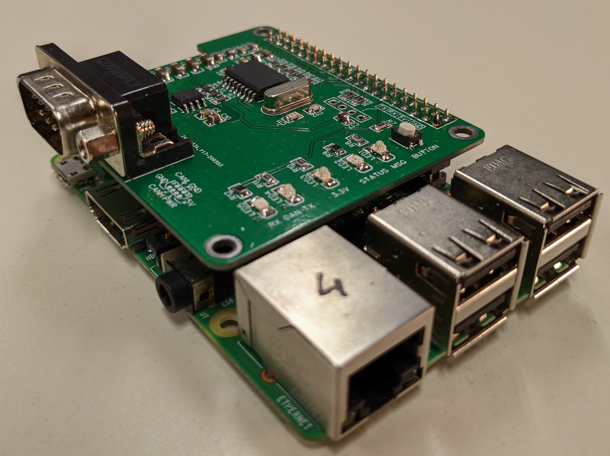
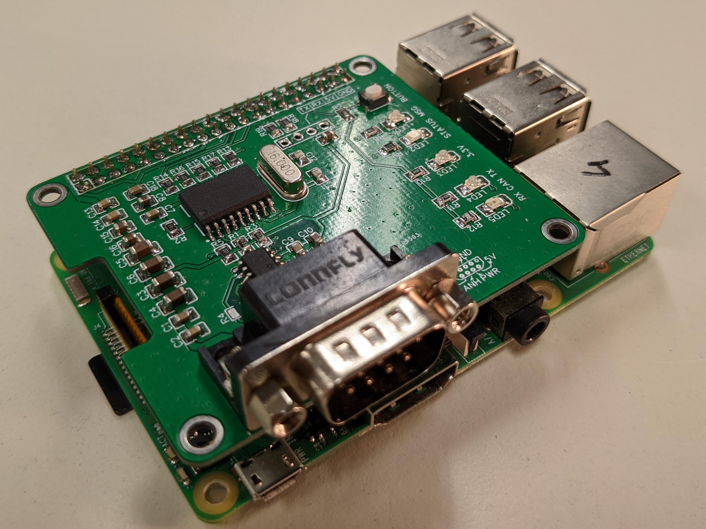
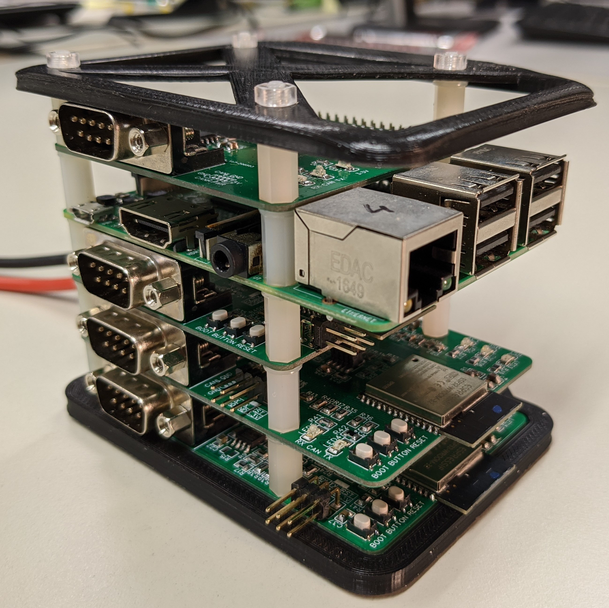
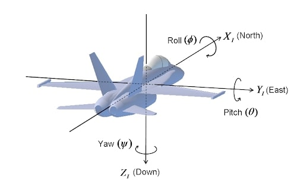
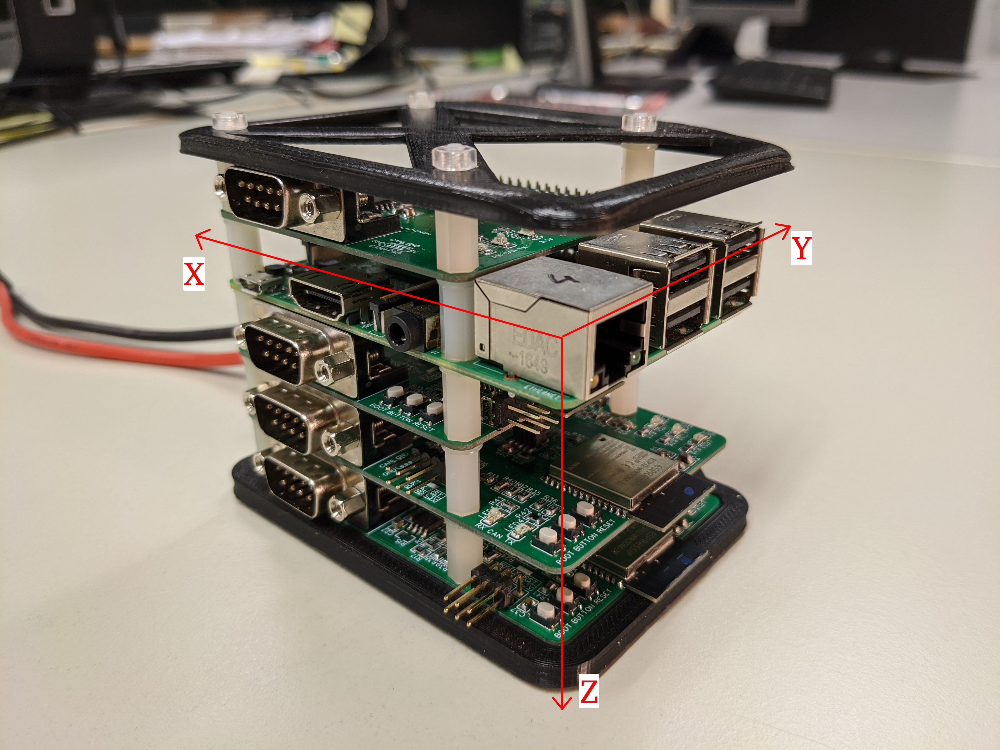

# Flight Control Computer (FCC)

This repository contains the code running on the Flight Control Computer (FCC). It controls and communicates the rest of the flight system via CAN (Controller Area Network).

## General
TODO

## Architecture

#### Directories
General overview of sub-directories. For more information consult `README.md` file in each sub-directory.
- `.github` contains GitHub workflow scripts (`.yml`).  
- `depend` contains all dependencies that are needed in order to build and run the code.
- `docs` contains documentation related files.
- `driver` contains hardware drivers used by `util` and `modules`.
- `logs` contains logfiles.
- `modules` contains the software modules that communicate with each other using Fast-DDS.
- `scripts` contains scripts for fast and efficient system management.
- `tests` contains unit and integration tests.
- `util` contains utility functions used by `driver` and `modules`.

#### Layout
TODO
- TODO some sort of visual graph

## Operating System

Start by setting up a "normal" RaspberryPi system. Then, follow the steps below:

- The RaspberryPi is running a Linux kernel with Rreempt-RT. Please follow [this](https://lemariva.com/blog/2019/09/raspberry-pi-4b-preempt-rt-kernel-419y-performance-test) tutorial in order to compile und upload the kernel to the RaspberryPi.

- In order to install Fast-RTPS use [this](https://github.com/eProsima/Fast-DDS#manual-installation).

- For Mavlink have a look here [this](https://mavlink.io/en/getting_started/installation.html) tutorial.

- To install the CAN driver and CAN utils use this tutorial [here](https://www.beyondlogic.org/adding-can-controller-area-network-to-the-raspberry-pi/).

- In order to get rid the locale errors put `export LC_ALL=C` at the bottom of the `.bashrc` in the home directory and reboot.

## Hardware
Currently we are using a RaspberryPi 3 (and 4) Model B. It is connected to a custom build shield (hat) that provides power and communication over the CAN Bus.

RaspberryPi with CAN interface shield:

RaspberryPi mounted in complete stack:

For more information about the shield have a look at the [`mfs-hardware`](https://github.com/tub-uas/mfs-hardware) repository.

## Operation
We are currently supporting 3x 3 Flightmodes `Mode`. Flightfunction `Func` selects which 3 Flightmodes are active. So on total we could theoretically support 9 different actual modes.

The 3 possible states `Mode` can be in are `MAN` `ATT` and `NAV`. The 3 possible states `Func` can be in are `FUNC1` `FUNC2` and `FUNC3`.

| Flightmode / Flightfunction | MAN            | ATT                           | NAV                             |
|:---------------------------:|:--------------:|:-----------------------------:|:-------------------------------:|
| FUNC1                       | Manual control | Pitch attitude control        | Pitch attitude and roll control |
| FUNC2                       | Manual control | Pitch rate damper             | Pitch attitude and roll damper  |
| FUNC3                       | Manual control | Pitch identification sequence | Yaw identification sequence     |

In addition to above presented modes / functions the pilot can decide whether the control output from the RaspberryPi should actually be used as control input to the aircraft or whether the aircraft should directly be controlled (without going through the RaspberryPi) from pilot commands. This is in addition to the "Manual control" option as seen in the table above where the signals are send through the RaspberryPi but not being modified. This is controlled via software running on the RAI board. We will call this pilot-overwrite.

## Dynamics and Control
We are using the following body coordinate system:

The `default` orientation coordinate system of the stack is the following:

Because the stack is turned onto its left side inside the Hype aircraft, the `hype` coordinate system is slightly different. While `x` stays the same `y` becomes `z` and `z` becomes `-y`.

## Styleguide
